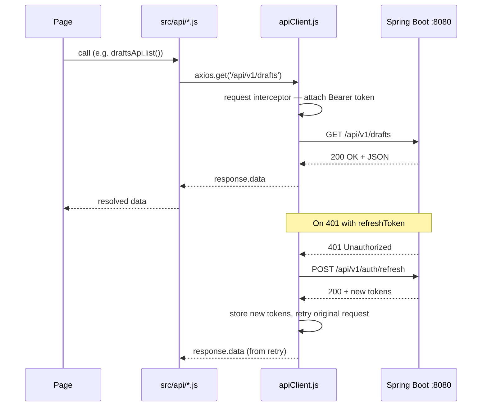
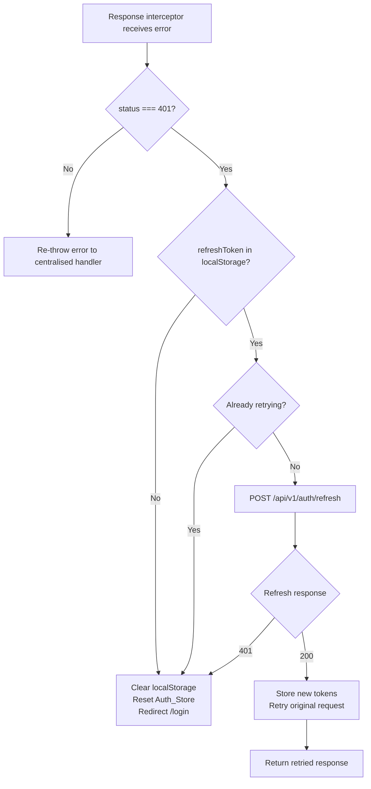

# Design Document — Frontend Integration with Backend API

## Overview

This document describes the technical design for replacing all mock data in the TalentCircle React frontend with real HTTP calls to the Spring Boot backend running at `http://localhost:8080`.

The integration covers five areas:

1. **HTTP client infrastructure** — a single Axios instance with JWT injection, token refresh, and centralised error handling.
2. **Authentication flow** — real login/logout with JWT persistence in localStorage and session restoration on app init.
3. **TypeScript type definitions** — interfaces for every API response shape, replacing the existing `Users.ts`.
4. **Per-page data fetching** — each page fetches its own data using `useEffect` + local `useState`, with independent loading and error states.
5. **Zustand store refactor** — remove all mock data constants, add token fields and `initAuth()`, keep UI state actions.

The frontend stack is React 19 + Vite (JavaScript source files, TypeScript only for type definitions), React Router DOM v7, Zustand v5, and Axios v1.15. No React Query is introduced.

---

## Architecture

### Request / Response Flow



### Token Refresh Flow



### Module Dependency Graph

```
App.jsx
  └── AppRouter.jsx
        ├── Login.jsx ──────────────── authApi.js
        ├── Dashboard.jsx ──────────── draftsApi.js + adminApi.js + collectorApi.js
        ├── Drafts.jsx ─────────────── draftsApi.js
        ├── Executions.jsx ─────────── adminApi.js
        └── Admin.jsx ──────────────── adminApi.js
              │
              └── All api modules use ──► apiClient.js
                                              │
                                              └── useAppStore.js (showToast, token read/write)
```

---

## Components and Interfaces

### `src/api/apiClient.js`

The single Axios instance shared by all API modules.

**Responsibilities:**
- Set `baseURL: 'http://localhost:8080'` and `Content-Type: application/json`.
- Request interceptor: read `accessToken` from localStorage and attach `Authorization: Bearer <token>` header.
- Response interceptor (success path): pass through unchanged.
- Response interceptor (error path):
  - HTTP 401 + refreshToken present + not already retrying → call `POST /api/v1/auth/refresh`, store new tokens, retry.
  - HTTP 401 + no refreshToken, or refresh itself returns 401 → clear localStorage, call `useAppStore.getState().logout()`, redirect to `/login`.
  - HTTP 403 → call `showToast` with "No tienes permisos para realizar esta acción."
  - All other 4xx/5xx → extract `error.response.data.message` or fall back to "Error de conexión. Intenta de nuevo."
  - Network error (no response) → "Sin conexión con el servidor. Verifica que el backend esté activo."
  - All errors are re-thrown after toast so callers can set `loading = false` in their `catch` blocks.

**Key implementation note:** The retry guard uses a `_retry` flag on the original request config to prevent infinite loops.

### `src/api/authApi.js`

```
login(email, password)   → POST /api/v1/auth/login       → LoginResponse
logout()                 → POST /api/v1/auth/logout       → void
refresh(refreshToken)    → POST /api/v1/auth/refresh      → LoginResponse
```

### `src/api/draftsApi.js`

```
list(filters)            → GET  /api/v1/drafts            → DraftSummaryDto[]
  filters: { channel?, status?, weekStart?, weekEnd?, page?, size? }
getDetail(id)            → GET  /api/v1/drafts/{id}       → DraftDetailDto
approve(id)              → POST /api/v1/drafts/{id}/approve → DraftDetailDto
reject(id, reason)       → POST /api/v1/drafts/{id}/reject  → DraftDetailDto
updateContent(id, content) → PATCH /api/v1/drafts/{id}/content → DraftDetailDto
```

### `src/api/adminApi.js`

```
getUsers()               → GET  /api/v1/admin/users              → UserDto[]
createUser(data)         → POST /api/v1/admin/users              → UserDto
updateUser(id, data)     → PUT  /api/v1/admin/users/{id}         → UserDto

getSources()             → GET  /api/v1/admin/sources            → SourceDto[]
createSource(data)       → POST /api/v1/admin/sources            → SourceDto
updateSource(id, data)   → PUT  /api/v1/admin/sources/{id}       → SourceDto

getConfig()              → GET  /api/v1/admin/config             → ConfigDto
updateConfig(data)       → PUT  /api/v1/admin/config             → ConfigDto

getExecutions()          → GET  /api/v1/admin/executions         → ExecutionSummaryDto[]
triggerExecution(email)  → POST /api/v1/admin/executions/trigger → void (202)
```

### `src/api/collectorApi.js`

```
getActivities(executionId) → GET /api/v1/admin/collector/activities?executionId={id}
                           → CommunityActivityDto[]
```

### `src/store/useAppStore.js` — Refactored Shape

The store is refactored to remove all mock data and add token management:

```javascript
{
  // Auth
  isAuthenticated: false,
  currentUser: null,          // UserDto | null
  accessToken: null,          // string | null
  refreshToken: null,         // string | null

  // Actions
  login(loginResponse),       // stores tokens in state + localStorage, sets isAuthenticated
  logout(),                   // clears tokens from state + localStorage, sets isAuthenticated=false
  initAuth(),                 // reads tokens from localStorage on app start

  // UI state (unchanged)
  toast: null,
  showToast(icon, title, body),
  modalDraftId: null,
  openModal(id),
  closeModal(),

  // Data (no initial values — pages own their local state)
  drafts: [],                 // populated by Drafts page via setDrafts
  executions: [],             // populated by Executions page via setExecutions
  feedItems: [],              // populated by Dashboard page via setFeedItems

  // Setters
  setDrafts(drafts),
  setExecutions(executions),
  setFeedItems(feedItems),
  updateDraftStatus(id, status, extra),
  updateDraftContent(id, content),
}
```

**`initAuth()` logic:**
```javascript
initAuth: () => {
  const accessToken = localStorage.getItem('accessToken')
  const refreshToken = localStorage.getItem('refreshToken')
  if (accessToken && refreshToken) {
    set({ isAuthenticated: true, accessToken, refreshToken })
  }
}
```

`initAuth()` is called once in `App.jsx` (or the root component) on mount via `useEffect`.

### Per-Page Data Fetching Pattern

Every page that fetches data follows this pattern:

```javascript
const [data, setData] = useState([])
const [loading, setLoading] = useState(true)
const [error, setError] = useState(null)

useEffect(() => {
  let cancelled = false
  setLoading(true)
  someApi.getData()
    .then((result) => { if (!cancelled) setData(result) })
    .catch((err) => { if (!cancelled) setError(err) })
    .finally(() => { if (!cancelled) setLoading(false) })
  return () => { cancelled = true }
}, [])
```

The `cancelled` flag prevents state updates on unmounted components. The `finally` block guarantees `loading` is always set to `false` after a fetch completes, regardless of outcome.

Action buttons (approve, reject, save) use a separate `actionLoading` boolean:

```javascript
const [actionLoading, setActionLoading] = useState(false)

const handleApprove = async (id) => {
  setActionLoading(true)
  try {
    await draftsApi.approve(id)
    // update local state
  } finally {
    setActionLoading(false)
  }
}
```

### `AppRouter.jsx` — Auth Initialisation

`initAuth()` is called at app startup so the protected route check reads real token state:

```javascript
// App.jsx or root component
useEffect(() => {
  useAppStore.getState().initAuth()
}, [])
```

`ProtectedRoute` already reads `isAuthenticated` from the store — no changes needed there.

### `Login.jsx` — Real Auth Flow

The mock `setTimeout` is replaced with a real `authApi.login()` call:

```javascript
const handleSubmit = async (e) => {
  e.preventDefault()
  setLoading(true)
  try {
    const response = await authApi.login(email, password)
    login(response)                          // store action
    navigate('/dashboard')
  } catch {
    // error already toasted by apiClient interceptor
  } finally {
    setLoading(false)
  }
}
```

The `login(response)` store action stores `accessToken`, `refreshToken`, `user` in state and persists tokens to localStorage.

---

## Data Models

### `src/types/api.ts`

All TypeScript interfaces for API response shapes. This file replaces `src/types/Users.ts`.

```typescript
export interface LoginResponse {
  accessToken: string;
  refreshToken: string;
  expiresIn: string;
  user: UserDto;
}

export interface UserDto {
  id: string;
  email: string;
  fullName: string;
  role: 'ADMIN' | 'EDITOR';
  active: boolean;
}

export interface DraftSummaryDto {
  id: string;
  channel: 'NEWSLETTER' | 'LINKEDIN' | 'TWITTER';
  status: 'PENDING' | 'APPROVED' | 'REJECTED' | 'PUBLISHED';
  createdAt: string;
  summary: string;
}

export interface DraftDetailDto {
  id: string;
  channel: 'NEWSLETTER' | 'LINKEDIN' | 'TWITTER';
  content: string;
  editedContent: string | null;
  status: 'PENDING' | 'APPROVED' | 'REJECTED' | 'PUBLISHED';
  aiScore: number;
  createdAt: string;
  updatedAt: string;
  sources: DraftSourceDto[];
  versions: DraftVersionDto[];
}

export interface DraftSourceDto {
  id: string;
  title: string;
  relevanceScore: number;
}

export interface DraftVersionDto {
  id: string;
  content: string;
  editedBy: string | null;
  editedAt: string;
  versionNumber: number;
}

export interface SourceDto {
  id: string;
  name: string;
  type: 'DISCORD' | 'CIRCLE' | 'SLACK';
  active: boolean;
}

export interface ConfigDto {
  llmProvider: string;
  llmModel: string;
  newsletterPrompt: string;
  linkedinPrompt: string;
  twitterPrompt: string;
  maxItemsPerChannel: number;
  scheduleCron: string;
}

export interface ExecutionSummaryDto {
  id: string;
  weekStart: string;
  weekEnd: string;
  status: 'COMPLETED' | 'RUNNING' | 'FAILED';
  startedAt: string;
  completedAt: string | null;
}

export interface CommunityActivityDto {
  id: string;
  title: string;
  content: string;
  type: 'POST' | 'QUESTION' | 'RESOURCE';
  reactionCount: number;
  responseCount: number;
  shareCount: number;
  author: string;
  sourceUrl: string;
}

export interface ApiErrorResponse {
  error: string;
  message: string;
  timestamp: string;
}
```

**Note on `Users.ts`:** The existing `src/types/Users.ts` and `src/services/userService.ts` are superseded by `UserDto` in `api.ts` and `adminApi.js` respectively. Both legacy files are deleted as part of this feature.

### Backend API Field Mapping

The backend returns camelCase JSON. Key field name differences to be aware of:

| Backend field | Frontend usage | Notes |
|---|---|---|
| `DraftSummaryDto.summary` | displayed as preview text | not `preview` |
| `DraftDetailDto.aiScore` | displayed as score | not `score` |
| `ExecutionSummaryDto.weekStart/weekEnd` | formatted for display | ISO date strings |
| `CommunityActivityDto.reactionCount` | displayed as reactions | not `reactions` |

The Drafts page currently uses `draft.preview`, `draft.score`, `draft.channelLabel`, etc. — these field names must be updated to match the API response shape (`summary`, `aiScore`, `channel`). Channel labels are derived in the component from the `channel` enum value.

---

## Correctness Properties

*A property is a characteristic or behavior that should hold true across all valid executions of a system — essentially, a formal statement about what the system should do. Properties serve as the bridge between human-readable specifications and machine-verifiable correctness guarantees.*

### Property 1: Token persistence after login

*For any* valid `LoginResponse` (with any `accessToken` and `refreshToken` string values), after the `login()` store action is called with that response, `localStorage.getItem('accessToken')` must equal `response.accessToken` and `localStorage.getItem('refreshToken')` must equal `response.refreshToken`.

**Validates: Requirements 2.2**

### Property 2: Token absence after logout

*For any* authenticated session state (any stored token values), after the `logout()` store action is called, `localStorage.getItem('accessToken')` must be `null` and `localStorage.getItem('refreshToken')` must be `null`, and `isAuthenticated` must be `false`.

**Validates: Requirements 2.5**

### Property 3: Session restoration from localStorage

*For any* pair of non-empty strings `(accessToken, refreshToken)` stored in localStorage, calling `initAuth()` must result in `isAuthenticated === true` and the store's `accessToken` and `refreshToken` fields matching the stored values. Conversely, if either token is absent from localStorage, `initAuth()` must leave `isAuthenticated === false`.

**Validates: Requirements 2.4**

### Property 4: User object round-trip through store

*For any* `UserDto` object received in a `LoginResponse`, after calling `login(response)`, `useAppStore.getState().currentUser` must deeply equal `response.user`.

**Validates: Requirements 2.7**

### Property 5: Authorization header injection

*For any* non-empty `accessToken` string stored in localStorage, every request dispatched through `apiClient` must include an `Authorization` header with value `'Bearer ' + accessToken`.

**Validates: Requirements 1.2**

### Property 6: Error message propagation

*For any* API error response that contains a `message` field, the centralised error interceptor must call `showToast` with that exact `message` string (not a fallback).

**Validates: Requirements 8.1, 8.4**

### Property 7: Loading flag always false after fetch

*For any* page-level data fetch operation (success or error), after the fetch settles, the local `loading` state must be `false`. This holds regardless of whether the API call succeeds, returns an error status, or throws a network error.

**Validates: Requirements 9.2**

### Property 8: Independent loading states

*For any* combination of page components rendered simultaneously, setting `loading = true` in one page's local state must not affect the `loading` state of any other page.

**Validates: Requirements 9.4**

### Property 9: Filter parameters passed to API

*For any* valid combination of `channel` (NEWSLETTER, LINKEDIN, TWITTER, or absent) and `status` (PENDING, APPROVED, REJECTED, PUBLISHED, or absent) filter values selected in the Drafts UI, the resulting `GET /api/v1/drafts` call must include exactly those values as query parameters (and omit parameters that are not set).

**Validates: Requirements 4.4**

### Property 10: Dashboard stat derivation — pending count

*For any* array of `DraftSummaryDto` objects, the "Pendientes de Revisión" stat displayed on the Dashboard must equal the count of items in that array where `status === 'PENDING'`.

**Validates: Requirements 7.6**

### Property 11: Dashboard most-recent execution used for activities

*For any* non-empty array of `ExecutionSummaryDto` objects, the `GET /api/v1/admin/collector/activities` call must use the `id` of the execution with the lexicographically greatest `startedAt` value (i.e., the most recent execution).

**Validates: Requirements 7.2**

---

## Error Handling

### Centralised Interceptor Strategy

All error handling lives in `apiClient.js`'s response interceptor. Individual API modules (`authApi.js`, `draftsApi.js`, etc.) do **not** catch errors — they let them propagate. Page components catch errors only to set `loading = false` and optionally set a local `error` state for empty-state rendering.

### Error Classification Table

| Condition | Toast message | Side effect |
|---|---|---|
| HTTP 401, no refreshToken | — | Clear localStorage, logout(), redirect /login |
| HTTP 401, refresh succeeds | — | Retry original request transparently |
| HTTP 401, refresh fails | — | Clear localStorage, logout(), redirect /login |
| HTTP 403 | "No tienes permisos para realizar esta acción." | None |
| HTTP 4xx (other) | `response.data.message` or fallback | None |
| HTTP 5xx | `response.data.message` or fallback | None |
| Network error | "Sin conexión con el servidor. Verifica que el backend esté activo." | None |
| No `message` field | "Error de conexión. Intenta de nuevo." | None |

### Special Case: Execution Trigger (HTTP 400)

The Executions page catches the error from `adminApi.triggerExecution()` and checks if the status is 400 to display the specific message "Ya hay una ejecución en curso". The centralised interceptor still fires first (showing a generic toast), so the page-level handler should suppress the default toast for this specific case — or the interceptor can be extended to check for this specific error code.

Design decision: the interceptor handles the toast; the page does not need to add a second handler. The backend returns a descriptive `message` field in the 400 response body, so the interceptor's standard message extraction will display the correct text automatically.

---

## Testing Strategy

### Dual Testing Approach

Unit tests cover specific examples, edge cases, and error conditions. Property-based tests verify universal properties across many generated inputs.

### Property-Based Testing Library

**[fast-check](https://github.com/dubzzz/fast-check)** is the chosen PBT library for JavaScript/TypeScript. It integrates with Vitest (the natural test runner for Vite projects) and supports arbitrary generators for strings, objects, arrays, and custom types.

Install:
```bash
npm install --save-dev fast-check vitest @testing-library/react @testing-library/jest-dom jsdom
```

Each property test runs a minimum of **100 iterations** (fast-check default). Tests are tagged with a comment referencing the design property:

```javascript
// Feature: frontend-backend-integration, Property 1: Token persistence after login
test.prop([fc.record({ accessToken: fc.string(), refreshToken: fc.string(), ... })])(
  'login stores tokens in localStorage',
  (loginResponse) => { ... }
)
```

### Property Test Implementations

**Property 1 & 2 — Token persistence / absence:**
```javascript
// fast-check generates random LoginResponse objects
// Verify localStorage state after login() and logout()
fc.assert(fc.property(
  fc.record({ accessToken: fc.string({ minLength: 1 }), refreshToken: fc.string({ minLength: 1 }), ... }),
  (response) => {
    useAppStore.getState().login(response)
    expect(localStorage.getItem('accessToken')).toBe(response.accessToken)
    useAppStore.getState().logout()
    expect(localStorage.getItem('accessToken')).toBeNull()
  }
))
```

**Property 3 — Session restoration:**
```javascript
fc.assert(fc.property(
  fc.string({ minLength: 1 }), fc.string({ minLength: 1 }),
  (accessToken, refreshToken) => {
    localStorage.setItem('accessToken', accessToken)
    localStorage.setItem('refreshToken', refreshToken)
    useAppStore.getState().initAuth()
    expect(useAppStore.getState().isAuthenticated).toBe(true)
  }
))
```

**Property 7 — Loading always false after fetch:**
```javascript
// Mock API to randomly succeed or fail
// Verify loading=false in both cases after fetch settles
```

**Property 10 — Pending count derivation:**
```javascript
fc.assert(fc.property(
  fc.array(fc.record({ status: fc.constantFrom('PENDING','APPROVED','REJECTED','PUBLISHED'), ... })),
  (drafts) => {
    const expected = drafts.filter(d => d.status === 'PENDING').length
    expect(derivePendingCount(drafts)).toBe(expected)
  }
))
```

### Unit Test Coverage

| Area | Test type | Key scenarios |
|---|---|---|
| `apiClient.js` | Unit | 401 retry flow, 401 no-refresh redirect, 403 message, network error, fallback message |
| `authApi.js` | Unit | login success, login 401, logout always clears |
| `draftsApi.js` | Unit | list with filters, approve, reject with reason, updateContent |
| `adminApi.js` | Unit | parallel fetch on Admin mount, trigger 400 message |
| `Login.jsx` | Component | loading spinner while in-flight, button disabled, navigate on success |
| `Drafts.jsx` | Component | skeleton while loading, empty state, filter chips trigger API |
| `Dashboard.jsx` | Component | stat card values derived from API data |
| `Executions.jsx` | Component | skeleton while loading, trigger button disabled while in-flight |
| `Admin.jsx` | Component | three parallel fetches on mount, toggle source, save config |

### Integration Tests

Not automated in this feature — manual testing against the running backend covers end-to-end flows. The backend has its own integration test suite.
