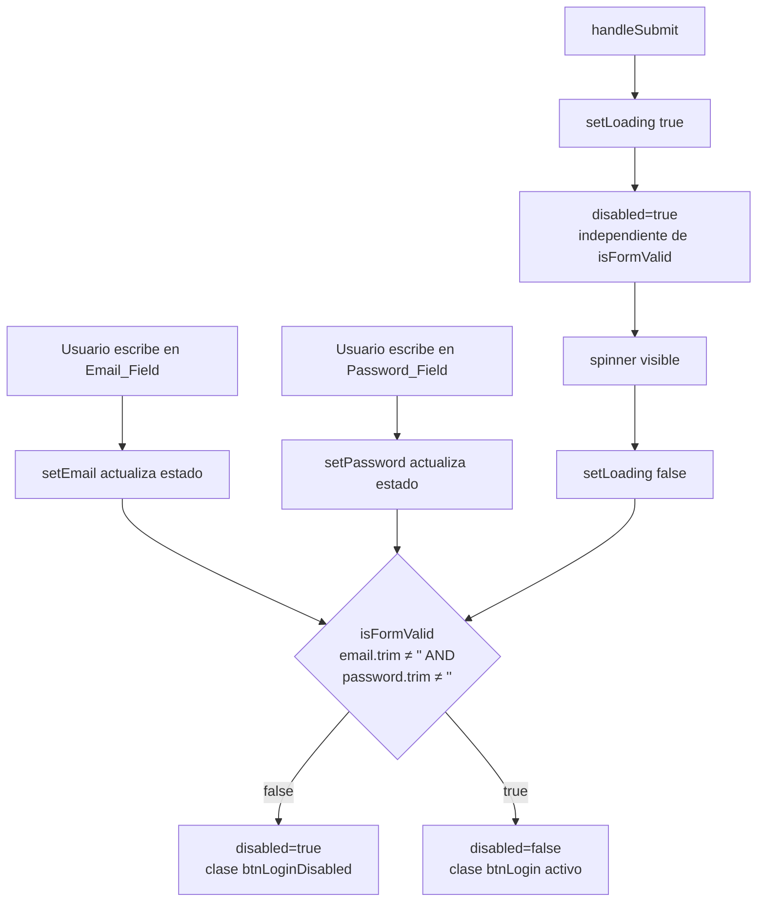

# Design Document — login-button-validation

## Overview

Esta mejora extiende el componente `Login.jsx` para que el botón "Ingresar al panel" refleje visualmente si el formulario está listo para enviarse. La lógica es mínima: una variable derivada `isFormValid` calculada a partir de los estados existentes `email` y `password`. No se introduce ningún estado nuevo, ninguna llamada a API adicional ni ninguna dependencia externa.

El cambio afecta dos archivos:

| Archivo | Cambio |
|---------|--------|
| `Login.jsx` | Derivar `isFormValid`, actualizar prop `disabled` del botón, aplicar clase condicional |
| `Login.module.css` | Añadir clase `.btnLoginDisabled` con estilo gris/neutro |

### Objetivo de UX

El usuario debe poder distinguir de un vistazo si el botón está activo (amber) o inactivo (gris). La transición ocurre en tiempo real mientras escribe, sin recargar la página.

---

## Architecture

El componente `Login` es un formulario React controlado. Toda la lógica de estado vive en el propio componente mediante `useState`. No hay contexto global ni store de Zustand involucrado en esta mejora.



**Flujo de datos:**

1. Cada keystroke en los inputs actualiza `email` o `password` vía `onChange`.
2. `isFormValid` se recalcula en cada render como expresión derivada (no estado).
3. El botón recibe `disabled={loading || !isFormValid}` y una clase CSS condicional.
4. El spinner de carga no cambia: sigue dependiendo únicamente de `loading`.

---

## Components and Interfaces

### Componente: `Login` (modificado)

**Archivo:** `frontend/talentcircle-app/src/pages/Login/Login.jsx`

#### Variable derivada

```jsx
const isFormValid = email.trim().length > 0 && password.trim().length > 0
```

- Es una expresión pura derivada del estado existente.
- No requiere `useMemo` dado que el componente es pequeño y el cálculo es O(1).
- Se recalcula en cada render, lo cual es correcto y esperado.

#### Prop `disabled` del botón

```jsx
<button
  type="submit"
  className={`${styles.btnLogin} ${!isFormValid && !loading ? styles.btnLoginDisabled : ''}`}
  disabled={loading || !isFormValid}
>
```

**Decisión de diseño — clase condicional vs selector `:disabled`:**

El selector CSS `:disabled` ya existe en `.btnLogin:disabled` con `opacity:.8; cursor:default`. Sin embargo, ese selector se activa tanto para el estado de carga como para el estado de campos vacíos, lo que impide diferenciarlos visualmente. La solución es añadir una clase `.btnLoginDisabled` que se aplica **solo** cuando `!isFormValid && !loading`, sobreescribiendo el gradiente amber con un color neutro.

| Condición | `disabled` | Clase extra | Estilo visible |
|-----------|-----------|-------------|----------------|
| Campos vacíos, sin carga | `true` | `.btnLoginDisabled` | Gris neutro |
| Campos llenos, sin carga | `false` | — | Amber activo |
| Cargando (cualquier estado de campos) | `true` | — | Amber + spinner (opacity .8) |

> **Rationale:** Mantener el estilo amber durante la carga es intencional — el usuario ya completó los campos y el sistema está procesando. El gris solo comunica "aún no puedes enviar esto".

#### Lógica del spinner

Sin cambios. El spinner sigue renderizándose condicionalmente sobre `loading`:

```jsx
{loading ? <span className={styles.spinner} /> : 'Ingresar al panel →'}
```

### Módulo CSS: `Login.module.css` (modificado)

Se añade la clase `.btnLoginDisabled` al final del archivo:

```css
.btnLoginDisabled {
  background: var(--surface-2, #2a2f48);
  color: var(--text3, #6b7280);
  box-shadow: none;
  cursor: not-allowed;
}
```

**Decisión de diseño — variables CSS vs valores hardcoded:**

Se usan variables CSS del design system (`--surface-2`, `--text3`) para mantener coherencia con el tema oscuro existente. Se proveen fallbacks con valores concretos para robustez. El gradiente amber queda implícitamente anulado porque `background` sobreescribe el `linear-gradient` de `.btnLogin`.

**Interacción con `.btnLogin:disabled`:**

Cuando `.btnLoginDisabled` está activo, el botón también tiene `disabled`, por lo que `.btnLogin:disabled` también aplica (`opacity:.8; cursor:default`). La propiedad `cursor` de `.btnLoginDisabled` (`not-allowed`) tiene mayor especificidad al estar en una clase adicional, por lo que prevalece correctamente.

---

## Data Models

Esta mejora no introduce modelos de datos nuevos. Opera exclusivamente sobre el estado local del componente.

### Estado existente (sin cambios)

```typescript
// Estado del componente Login
email:    string   // valor del campo email, controlado
password: string   // valor del campo password, controlado
loading:  boolean  // true mientras la petición de auth está en vuelo
```

### Variable derivada (nueva, no es estado)

```typescript
// Derivada — calculada en cada render, no almacenada en estado
isFormValid: boolean  // email.trim().length > 0 && password.trim().length > 0
```

### Invariantes del modelo

- `isFormValid` es siempre una función pura de `email` y `password`.
- `isFormValid` nunca puede ser `true` si `email.trim()` o `password.trim()` tienen longitud 0.
- `loading === true` implica `disabled === true` independientemente de `isFormValid`.
- `loading === false && isFormValid === true` implica `disabled === false`.

---

## Correctness Properties

*Una propiedad es una característica o comportamiento que debe mantenerse verdadero en todas las ejecuciones válidas del sistema — esencialmente, una declaración formal sobre lo que el sistema debe hacer. Las propiedades sirven como puente entre las especificaciones legibles por humanos y las garantías de corrección verificables por máquina.*

Las propiedades a continuación son adecuadas para property-based testing porque `isFormValid` es una función pura de `email` y `password`, el espacio de inputs es grande (cualquier string), y 100 iteraciones con inputs generados aleatoriamente revelarán edge cases que los ejemplos manuales no cubren (strings con solo tabs, newlines, combinaciones de espacios, etc.).

### Property 1: Campos vacíos o solo-espacios deshabilitan el botón y aplican la clase de estilo deshabilitado

*Para cualquier* par `(email, password)` donde al menos uno de los dos tiene longitud trimmed igual a 0, el botón de login debe tener el atributo `disabled` y debe tener la clase `.btnLoginDisabled` aplicada en su `className`, asumiendo que `loading` es `false`.

**Validates: Requirements 1.1, 2.1, 4.1, 4.2**

### Property 2: Campos con contenido válido y sin carga habilitan el botón con estilo activo

*Para cualquier* par `(email, password)` donde ambos tienen longitud trimmed mayor a 0, y con `loading = false`, el botón de login NO debe tener el atributo `disabled` y NO debe tener la clase `.btnLoginDisabled` en su `className`.

**Validates: Requirements 1.4, 2.3**

### Property 3: El estado de carga deshabilita el botón independientemente del contenido de los campos

*Para cualquier* par `(email, password)` (incluyendo pares completamente válidos), cuando `loading = true`, el botón de login debe tener el atributo `disabled`.

**Validates: Requirements 3.1**

---

## Error Handling

Esta mejora no introduce nuevas rutas de error. El manejo de errores existente no cambia:

| Escenario | Comportamiento actual (sin cambios) |
|-----------|-------------------------------------|
| Credenciales incorrectas | El interceptor de `apiClient` muestra un toast de error. `loading` vuelve a `false`. El botón se re-habilita si los campos siguen llenos. |
| Error de red | Mismo comportamiento que credenciales incorrectas. |
| Campos vacíos al enviar | Imposible: el botón está `disabled`, el navegador no dispara el evento `submit`. |

### Consideración: whitespace en credenciales enviadas

`isFormValid` usa `trim()` solo para la validación visual del botón. El valor enviado a `authApi.login(email, password)` sigue siendo el valor sin trim. Esto es correcto: si el usuario escribe `" admin "` en el campo email, el botón se habilitará (porque `" admin ".trim().length > 0`) y el backend recibirá `" admin "` tal cual. El backend es responsable de validar y sanitizar las credenciales.

> **Decisión de diseño:** No aplicar `trim()` al valor enviado en `handleSubmit`. Hacerlo podría causar confusión si el backend acepta credenciales con espacios (poco probable pero posible). La responsabilidad de sanitización pertenece al backend.

---

## Testing Strategy

### Enfoque dual

Se combinan tests de ejemplo (para comportamientos concretos y transiciones de estado) con tests de propiedad (para garantías universales sobre el espacio de inputs).

### Librería de property-based testing

**[fast-check](https://github.com/dubzzz/fast-check)** — librería de PBT para JavaScript/TypeScript. Es la opción estándar en el ecosistema React/Vitest.

```bash
npm install --save-dev fast-check
```

### Tests de propiedad (mínimo 100 iteraciones cada uno)

Cada test de propiedad referencia su propiedad del documento de diseño mediante un comentario de tag:

```
// Feature: login-button-validation, Property {N}: {texto de la propiedad}
```

**Property 1 — Campos vacíos deshabilitan el botón:**
- Generadores: `fc.string()` filtrado para que `trim().length === 0` (strings vacíos y solo-espacios) para al menos uno de los campos; el otro puede ser cualquier string.
- Assertion: `button.disabled === true` y `button.className` incluye `btnLoginDisabled`.
- Iteraciones: 100+

**Property 2 — Campos llenos habilitan el botón:**
- Generadores: `fc.string({ minLength: 1 })` filtrado para que `trim().length > 0` para ambos campos.
- Assertion: `button.disabled === false` y `button.className` NO incluye `btnLoginDisabled`.
- Iteraciones: 100+

**Property 3 — Loading deshabilita el botón:**
- Generadores: `fc.string()` para email y password (cualquier valor), `loading = true` fijo.
- Assertion: `button.disabled === true`.
- Iteraciones: 100+

### Tests de ejemplo (example-based)

Los tests de ejemplo cubren transiciones de estado y comportamientos concretos que no son universales:

| Test | Descripción | Criterio |
|------|-------------|----------|
| Transición vacío → lleno | Escribir en ambos campos activa el botón | 2.4 |
| Transición lleno → vacío | Borrar un campo desactiva el botón | 2.5 |
| Spinner visible durante carga | `loading=true` muestra spinner, oculta texto | 3.2 |
| Recuperación post-error | Tras `loading=false` con campos llenos, botón se re-habilita | 3.3, 3.4 |

### Herramientas

| Herramienta | Uso |
|-------------|-----|
| Vitest | Test runner |
| React Testing Library | Renderizado y queries del DOM |
| fast-check | Generadores de inputs para property tests |
| `@testing-library/user-event` | Simulación de eventos de usuario |

### Cobertura esperada

- Los 3 tests de propiedad cubren el espacio de inputs de forma exhaustiva.
- Los 4 tests de ejemplo cubren las transiciones de estado y el comportamiento del spinner.
- No se necesitan tests de integración ni smoke tests: toda la lógica es local al componente.
