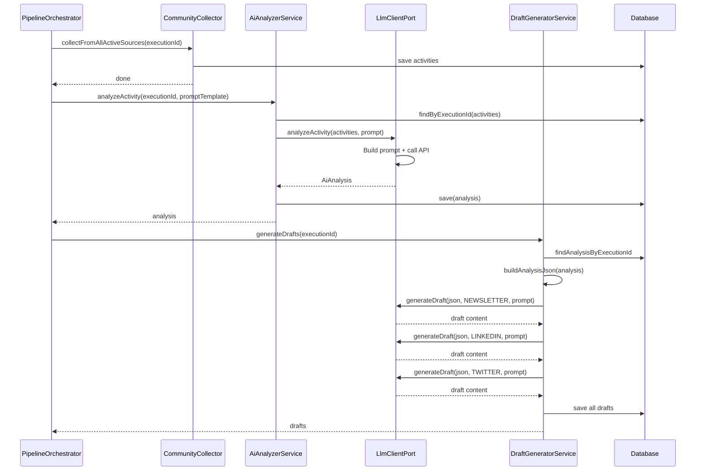

# Diseño Técnico de IA — TalentCircle Content Pipeline

## Arquitectura Hexagonal (Puertos y Adaptadores)

```
┌─────────────────────────────────────────────────────────────────────┐
│                       DOMAIN LAYER                                  │
│  ┌──────────────────────────────────────────────────────────────┐   │
│  │  Ports (In/Out)                                              │   │
│  │  ┌─────────────────┐  ┌────────────────────────────────┐    │   │
│  │  │ AiAnalyzerUseCase│  │ LlmClientPort (output port)   │    │   │
│  │  │ DraftGeneratorUse│  │  analyzeActivity()            │    │   │
│  │  │                  │  │  generateDraft()              │    │   │
│  │  │                  │  │  validateConnection()         │    │   │
│  │  └─────────────────┘  └────────────────────────────────┘    │   │
│  │                                                              │   │
│  │  Models: AiAnalysis, PipelineConfig, CommunityActivity       │   │
│  └──────────────────────────────────────────────────────────────┘   │
└─────────────────────────────────────────────────────────────────────┘
                                   │
                                   ▼
┌─────────────────────────────────────────────────────────────────────┐
│                     APPLICATION LAYER                                │
│  ┌────────────────────────┐  ┌────────────────────────────┐        │
│  │  AiAnalyzerService     │  │  DraftGeneratorService     │        │
│  │  - analyzeActivity()   │  │  - generateDrafts()        │        │
│  │                        │  │  - generateForChannel()    │        │
│  │  Depende de:           │  │  - validateAndTruncate()  │        │
│  │  └ LlmClientPort       │  │                            │        │
│  │  └ ActivityRepo        │  │  Depende de:               │        │
│  │  └ AnalysisRepo        │  │  └ LlmClientPort           │        │
│  └────────────────────────┘  │  └ AIAnalysisRepo           │        │
│                               │  └ DraftRepository         │        │
│                               └────────────────────────────┘        │
└─────────────────────────────────────────────────────────────────────┘
                                   │
                                   ▼
┌─────────────────────────────────────────────────────────────────────┐
│                       ADAPTER LAYER                                  │
│  ┌────────────────────────┐  ┌────────────────────────────┐        │
│  │  OpenAiClientAdapter   │  │  ClaudeClientAdapter       │        │
│  │  @ConditionalOnProperty│  │  @ConditionalOnProperty    │        │
│  │  (openai | matchIfMiss)│  │  (anthropic)               │        │
│  │                        │  │                            │        │
│  │  POST /v1/chat/        │  │  POST /v1/messages         │        │
│  │  completions           │  │  (Anthropic API)           │        │
│  │  (OpenAI API)          │  │                            │        │
│  └────────────────────────┘  └────────────────────────────┘        │
└─────────────────────────────────────────────────────────────────────┘
```

---

## Stack Tecnológico IA

| Componente | Tecnología | Versión |
|------------|------------|---------|
| LLM Interface | Interfaz Java (`LlmClientPort`) | - |
| OpenAI Adapter | `RestTemplate` + JSON manual | Spring Boot 3.3.5 |
| Claude Adapter | `RestTemplate` + JSON manual | Spring Boot 3.3.5 |
| Serialización | Jackson (`ObjectMapper`) | 2.x |
| Condición de Bean | `@ConditionalOnProperty` | Spring Boot 3.3.5 |
| Testing LLM | Mockito mocks + `@Mock` | 5.x |
| DB Analysis | JPA Entity `AiAnalysis` | Hibernate 6.x |
| DB Config | JPA Entity `PipelineConfig` | Hibernate 6.x |
| Modelo OpenAI | `gpt-4o-mini` (dev) / `gpt-4-turbo` (prod) | - |
| Modelo Claude | `claude-3-sonnet-20240229` | - |

---

## Flujo de Datos del Pipeline IA



---

## Modelo de Datos IA

### AiAnalysis (tabla `ai_analyses`)

| Columna | Tipo | Descripción |
|---------|------|-------------|
| id | VARCHAR (PK) | UUID generado automáticamente |
| execution_id | VARCHAR (FK → weekly_executions) | Ejecución asociada |
| top_topics | TEXT (JSON) | Topics identificados por el LLM |
| executive_summary | TEXT | Resumen ejecutivo en español |
| relevance_scores | TEXT (JSON) | Scores de relevancia por actividad |
| llm_provider | VARCHAR | Proveedor usado (openai / claude) |
| prompt_tokens | INTEGER | Tokens del prompt |
| completion_tokens | INTEGER | Tokens de la respuesta |
| created_at | TIMESTAMP | Auditoría (heredado de AuditableEntity) |
| updated_at | TIMESTAMP | Auditoría (heredado de AuditableEntity) |

### PipelineConfig (tabla `pipeline_configs`)

| Columna | Tipo | Descripción |
|---------|------|-------------|
| id | VARCHAR (PK) | UUID |
| llm_provider | VARCHAR | Proveedor activo (openai / anthropic) |
| llm_model | VARCHAR | Modelo activo |
| newsletter_prompt | TEXT | Prompt para newsletter |
| linkedin_prompt | TEXT | Prompt para LinkedIn |
| twitter_prompt | TEXT | Prompt para Twitter |
| max_items_per_channel | INTEGER | Máx ítems por canal (default: 10) |
| schedule_cron | VARCHAR | Cron de ejecución (default: `0 18 ? * FRI`) |

---

## Implementación de Adaptadores

### OpenAiClientAdapter

```java
@Component
@ConditionalOnProperty(name = "app.llm.provider", havingValue = "openai", matchIfMissing = true)
public class OpenAiClientAdapter implements LlmClientPort {

    // Config inyectada via @Value
    // app.llm.openai.api-key → OPENAI_API_KEY
    // app.llm.openai.model → gpt-4o-mini

    public AiAnalysis analyzeActivity(List<CommunityActivity> activities, String promptTemplate) {
        // 1. Build prompt with activities + template
        // 2. POST https://api.openai.com/v1/chat/completions
        // 3. Parse response, build AiAnalysis
        // 4. Return AiAnalysis (no persistido aún)
    }

    public String generateDraft(String analysisJson, String channel, String promptTemplate) {
        // 1. Build prompt with analysis + channel + template
        // 2. POST https://api.openai.com/v1/chat/completions
        // 3. Return raw content string
    }
}
```

### ClaudeClientAdapter

```java
@Component
@ConditionalOnProperty(name = "app.llm.provider", havingValue = "anthropic")
public class ClaudeClientAdapter implements LlmClientPort {
    // Misma interfaz, implementación para Anthropic API
    // POST https://api.anthropic.com/v1/messages
    // Header: x-api-key, anthropic-version
}
```

### Límites de Contenido por Canal

| Canal | Máximo caracteres | Comportamiento si excede |
|-------|-------------------|--------------------------|
| NEWSLETTER | 10,000 | Truncar a 9,997 + "..." |
| LINKEDIN | 3,000 | Truncar a 2,997 + "..." |
| TWITTER | 280 | Truncar a 277 + "..." |

---

## API de Testing

### Endpoints (públicos, sin autenticación)

| Método | Path | Descripción | Parámetros |
|--------|------|-------------|------------|
| GET | `/api/v1/test/openai/ping` | Verificar conexión LLM | `apiKey` (opcional) |
| POST | `/api/v1/test/openai/chat` | Chat de prueba | `{ message, prompt }` |
| POST | `/api/v1/test/openai/generate` | Probar generación | `{ analysisJson, channel, prompt }` |

---

## Configuración por Perfil

### Dev (application-dev.yml)
```yaml
app:
  llm:
    provider: ${LLM_PROVIDER:openai}
    openai:
      api-key: ${OPENAI_API_KEY:}
      model: ${OPENAI_MODEL:gpt-4o-mini}
    anthropic:
      api-key: ${ANTHROPIC_API_KEY:}
      model: ${ANTHROPIC_MODEL:claude-3-sonnet-20240229}
```

### Prod (application-prod.yml)
```yaml
app:
  llm:
    provider: ${LLM_PROVIDER:openai}
    openai:
      api-key: ${OPENAI_API_KEY}
      model: ${OPENAI_MODEL:gpt-4-turbo}
    anthropic:
      api-key: ${ANTHROPIC_API_KEY}
      model: ${ANTHROPIC_MODEL:claude-3-sonnet-20240229}
```

---

## Consideraciones de Seguridad

1. **API Keys**: Nunca en código fuente ni en repositorio. Solo vía variables de entorno.
2. **System Prompt**: Incluye instrucción explícita de generar contenido en español.
3. **Timeout**: 60 segundos por llamada LLM para evitar hilos bloqueados.
4. **Fallos**: Si el LLM falla, el pipeline marca la ejecución como FAILED pero preserva actividades recolectadas.
5. **Tokens**: Se registran para monitoreo de costos.

---

## Testing

### Unit Tests
- `AiAnalyzerServiceTest` — análisis con LLM mockeado
- `DraftGeneratorServiceTest` — generación por canal con validación de límites
- `OpenAiClientAdapterTest` — validateConnection y generateDraft con mock
- `ClaudeClientAdapterTest` — (cuando se implemente prueba específica)

### Property Tests
- Twitter draft nunca excede 280 caracteres
- Analysis siempre vinculado a execution cuando hay actividades
- Adapter activo corresponde a `app.llm.provider` configurado

### Mocking Strategy
```java
// Los tests unitarios mockean LlmClientPort
@Mock
private LlmClientPort llmClient;

// O directamente el adapter
@InjectMocks
private DraftGeneratorService draftGeneratorService;
```

---

*Documento de Diseño de IA — TalentCircle Content Pipeline v1.0 | Mayo 2026*
