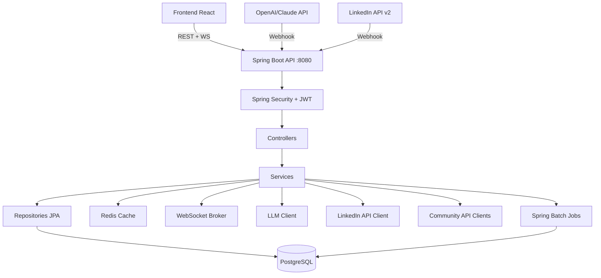
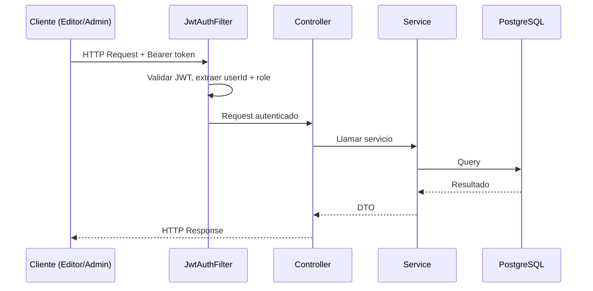
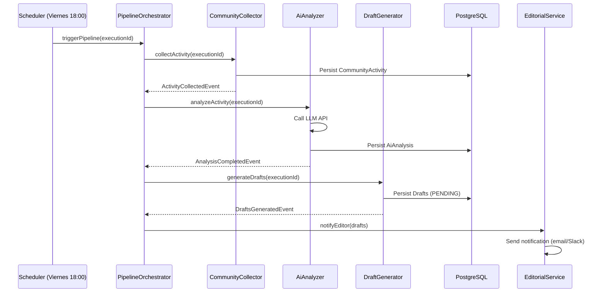
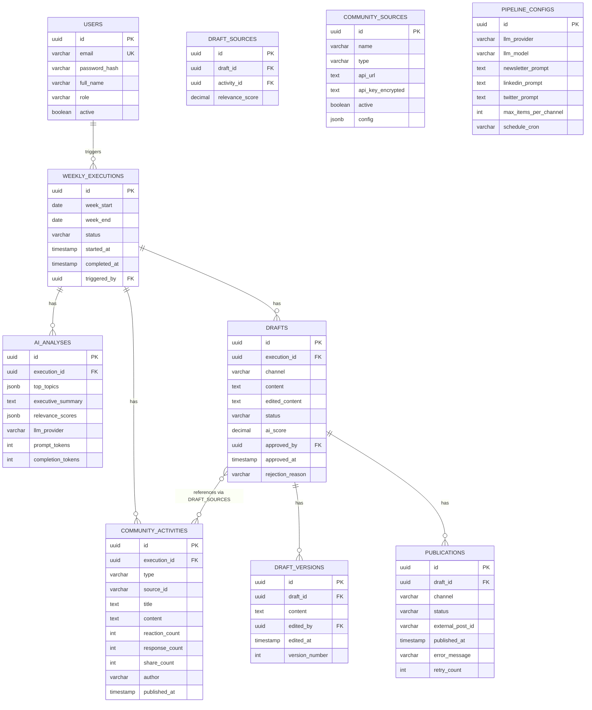
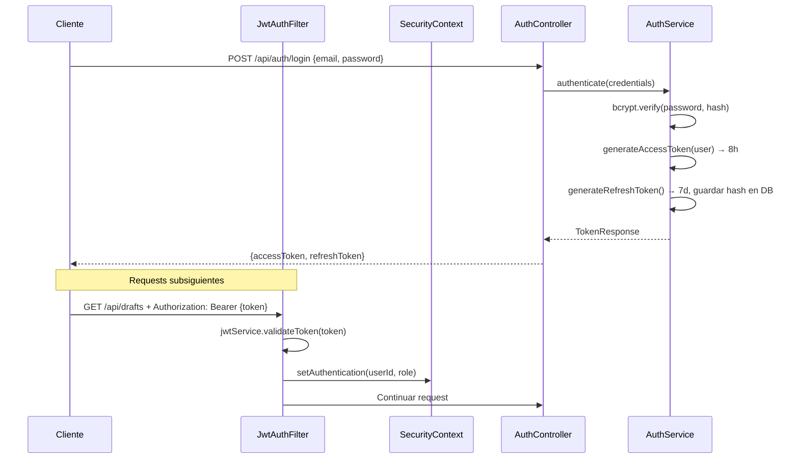
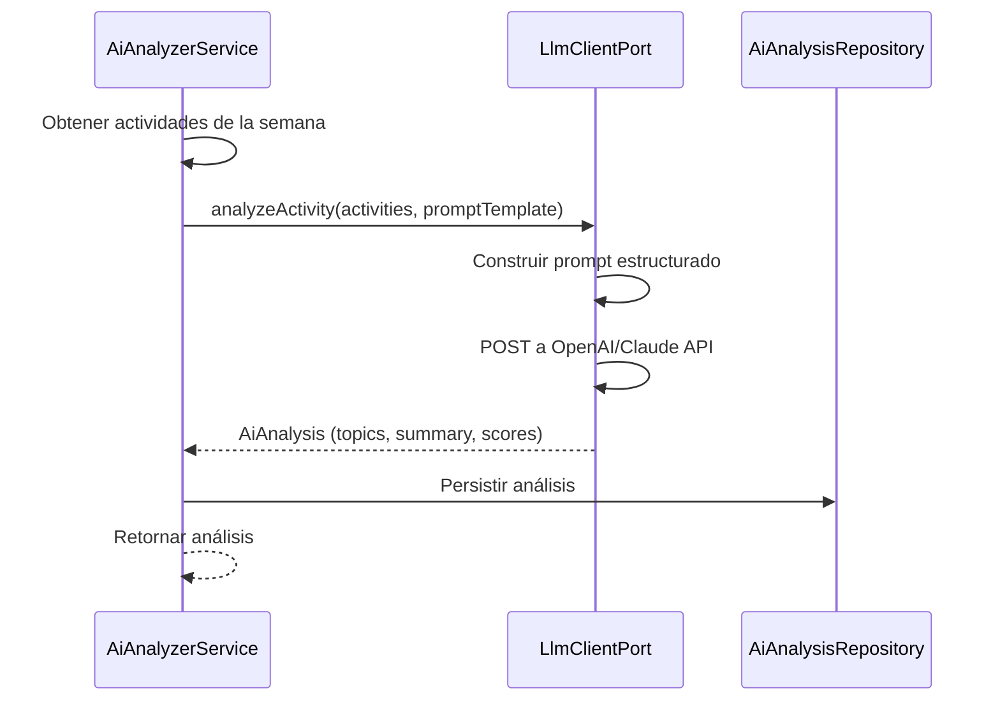
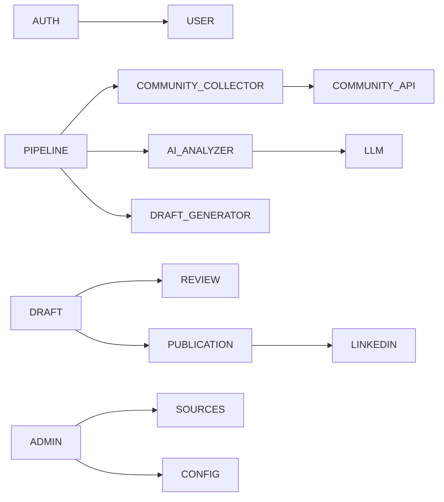

# Documento de Diseño: TalentCircle Content Pipeline

## Dependencias Spring Initializr

**URL**: https://start.spring.io

| Campo | Valor |
|-------|-------|
| Project | Maven |
| Language | Java |
| Spring Boot | 3.3.x |
| Group | com.talentcircle |
| Artifact | talentcircle-pipeline |
| Name | talentcircle-pipeline |
| Package name | com.talentcircle |
| Packaging | Jar |
| Java | 21 |

### Dependencias a seleccionar

| Categoría | Dependencia | Descripción |
|-----------|-------------|-------------|
| Web | Spring Web | REST controllers, Tomcat embebido |
| Web | Spring WebSocket | WebSocket para notificaciones en tiempo real |
| Security | Spring Security | Autenticación y autorización |
| Data | Spring Data JPA | ORM con Hibernate |
| Data | PostgreSQL Driver | Driver JDBC para PostgreSQL |
| Data | Spring Data Redis | Cache y sesiones con Redis |
| Batch | Spring Batch | Procesamiento de jobs por lotes |
| Messaging | Spring for Apache Kafka | Eventos asíncronos (opcional) |
| I/O | Spring Validation | Validación de DTOs con Bean Validation |
| Developer Tools | Lombok | Reducción de boilerplate |
| Developer Tools | Spring Boot DevTools | Hot reload en desarrollo |
| Ops | Spring Boot Actuator | Health checks y métricas |
| Ops | Spring Boot Starter Quartz | Programación de jobs con persistencia |
| Testing | Spring Boot Test | JUnit 5 + Mockito |

### Dependencias adicionales (agregar en pom.xml manualmente)

```xml
<!-- JWT -->
<dependency>
  <groupId>io.jsonwebtoken</groupId>
  <artifactId>jjwt-api</artifactId>
  <version>0.12.6</version>
</dependency>
<dependency>
  <groupId>io.jsonwebtoken</groupId>
  <artifactId>jjwt-impl</artifactId>
  <version>0.12.6</version>
  <scope>runtime</scope>
</dependency>
<dependency>
  <groupId>io.jsonwebtoken</groupId>
  <artifactId>jjwt-jackson</artifactId>
  <version>0.12.6</version>
  <scope>runtime</scope>
</dependency>

<!-- OpenAI / Anthropic Clients -->
<dependency>
  <groupId>org.springframework.boot</groupId>
  <artifactId>spring-boot-starter-webflux</artifactId>
</dependency>

<!-- OpenAPI / Swagger -->
<dependency>
  <groupId>org.springdoc</groupId>
  <artifactId>springdoc-openapi-starter-webmvc-ui</artifactId>
  <version>2.6.0</version>
</dependency>

<!-- MapStruct (mapeo DTO ↔ Entity) -->
<dependency>
  <groupId>org.mapstruct</groupId>
  <artifactId>mapstruct</artifactId>
  <version>1.6.3</version>
</dependency>
<dependency>
  <groupId>org.mapstruct</groupId>
  <artifactId>mapstruct-processor</artifactId>
  <version>1.6.3</version>
  <scope>provided</scope>
</dependency>

<!-- Apache Commons / Utilidades -->
<dependency>
  <groupId>org.apache.commons</groupId>
  <artifactId>commons-lang3</artifactId>
</dependency>

<!-- OpenCSV (exportación CSV) -->
<dependency>
  <groupId>com.opencsv</groupId>
  <artifactId>opencsv</artifactId>
  <version>5.9</version>
</dependency>

<!-- Jackson para JSONB de PostgreSQL -->
<dependency>
  <groupId>com.fasterxml.jackson.datatype</groupId>
  <artifactId>jackson-datatype-jsr310</artifactId>
</dependency>

<!-- RabbitMQ (mensajería asíncrona) -->
<dependency>
  <groupId>org.springframework.boot</groupId>
  <artifactId>spring-boot-starter-amqp</artifactId>
</dependency>
```

---

## Overview

Backend del pipeline de contenido automatizado para TalentCircle construido con Java 21 + Spring Boot 3.3 + PostgreSQL. Expone una API REST con autenticación JWT, panel editorial para revisión de borradores generados por IA, e integración con LLM (OpenAI/Claude) para análisis y generación de contenido.

El sistema automatiza la recolección de actividad comunitaria, análisis con IA, y generación de borradores diferenciados por canal (Newsletter, LinkedIn, Twitter), con flujo de aprobación editorial y publicación/exportación.

---

## Arquitectura General



### Flujo de Request



### Flujo del Pipeline (Event-Driven)



---

## Stack Tecnológico

| Componente | Tecnología | Versión |
|------------|------------|---------|
| Lenguaje | Java | 21 LTS |
| Framework | Spring Boot | 3.3.x |
| ORM | Spring Data JPA + Hibernate | 6.x |
| Base de datos | PostgreSQL | 16 |
| Migraciones | Flyway | 10.x |
| Batch Processing | Spring Batch | 5.x |
| Scheduler | Spring Scheduler + Quartz | - |
| Cache | Redis | 7.x |
| Seguridad | Spring Security + JWT (jjwt) | 0.12.x |
| Mensajería Async | Spring Events / RabbitMQ | - |
| LLM Integration | WebClient (OpenAI/Claude) | - |
| LinkedIn API | WebClient REST | v2 |
| Documentación | SpringDoc OpenAPI (Swagger UI) | 2.6.x |
| Mapeo | MapStruct | 1.6.x |
| Build | Maven | 3.9.x |
| Frontend | React 18 + TypeScript | 18.x |
| UI Components | TailwindCSS + shadcn/ui | - |
| State Management | Zustand + React Query | - |
| Contenedor | Docker + Docker Compose | - |

---

## Estructura de Paquetes (Arquitectura Hexagonal)

```
src/main/java/com/talentcircle/
├── TalentCircleApplication.java
│
├── config/
│   ├── SecurityConfig.java              # Spring Security + JWT filter chain
│   ├── OpenApiConfig.java              # Swagger / SpringDoc
│   ├── BatchConfig.java                # Spring Batch configuration
│   ├── QuartzConfig.java              # Quartz scheduler
│   ├── RabbitMQConfig.java            # Message broker (optional)
│   └── AppProperties.java             # @ConfigurationProperties
│
├── common/
│   ├── exception/
│   │   ├── GlobalExceptionHandler.java    # @RestControllerAdvice
│   │   ├── ResourceNotFoundException.java
│   │   ├── ForbiddenException.java
│   │   └── ConflictException.java
│   ├── dto/
│   │   ├── ApiResponse.java               # Wrapper genérico de respuesta
│   │   └── PageResponse.java             # Wrapper paginado
│   ├── security/
│   │   ├── JwtService.java               # Generar/validar tokens
│   │   ├── JwtAuthFilter.java            # OncePerRequestFilter
│   │   └── UserContext.java              # ThreadLocal userId + role
│   └── audit/
│       └── AuditableEntity.java          # @MappedSuperclass con created_at, updated_at
│
├── domain/
│   ├── model/                           # Entidades y Value Objects
│   │   ├── WeeklyExecution.java
│   │   ├── CommunityActivity.java
│   │   ├── AiAnalysis.java
│   │   ├── Draft.java
│   │   ├── DraftVersion.java
│   │   ├── DraftSource.java
│   │   ├── Publication.java
│   │   ├── User.java
│   │   ├── CommunitySource.java
│   │   └── PipelineConfig.java
│   │
│   ├── event/                           # Eventos de dominio
│   │   ├── PipelineStartedEvent.java
│   │   ├── ActivityCollectedEvent.java
│   │   ├── AnalysisCompletedEvent.java
│   │   ├── DraftsGeneratedEvent.java
│   │   ├── DraftApprovedEvent.java
│   │   └── DraftPublishedEvent.java
│   │
│   ├── port/
│   │   ├── in/                          # Input ports (casos de uso)
│   │   │   ├── PipelineOrchestratorUseCase.java
│   │   │   ├── DraftReviewUseCase.java
│   │   │   ├── AuthUseCase.java
│   │   │   └── AdminUseCase.java
│   │   │
│   │   └── out/                         # Output ports (repositorios y clientes)
│   │       ├── WeeklyExecutionRepository.java
│   │       ├── CommunityActivityRepository.java
│   │       ├── AiAnalysisRepository.java
│   │       ├── DraftRepository.java
│   │       ├── DraftVersionRepository.java
│   │       ├── PublicationRepository.java
│   │       ├── UserRepository.java
│   │       ├── CommunitySourceRepository.java
│   │       ├── PipelineConfigRepository.java
│   │       ├── LlmClientPort.java
│   │       ├── LinkedInClientPort.java
│   │       └── CommunityClientPort.java
│
├── application/
│   └── service/                         # Implementación de casos de uso
│       ├── PipelineOrchestratorService.java
│       ├── CommunityCollectorService.java
│       ├── AiAnalyzerService.java
│       ├── DraftGeneratorService.java
│       ├── DraftReviewService.java
│       ├── PublicationService.java
│       ├── AuthService.java
│       └── AdminService.java
│
├── adapter/
│   ├── in/
│   │   ├── web/                          # Controladores REST
│   │   │   ├── AuthController.java
│   │   │   ├── DraftController.java
│   │   │   ├── ExecutionController.java
│   │   │   └── AdminController.java
│   │   │
│   │   └── scheduler/                    # Jobs de Spring Scheduler / Quartz
│   │       ├── PipelineScheduler.java
│   │       └── TaskReminderScheduler.java
│   │
│   └── out/
│       ├── persistence/                   # Repositorios JPA + Entidades BD
│       │   ├── WeeklyExecutionJpaRepository.java
│       │   ├── CommunityActivityJpaRepository.java
│       │   ├── AiAnalysisJpaRepository.java
│       │   ├── DraftJpaRepository.java
│       │   ├── DraftVersionJpaRepository.java
│       │   ├── PublicationJpaRepository.java
│       │   ├── UserJpaRepository.java
│       │   ├── CommunitySourceJpaRepository.java
│       │   └── PipelineConfigJpaRepository.java
│       │
│       ├── llm/                          # Cliente HTTP para LLM
│       │   ├── OpenAiClientAdapter.java
│       │   └── ClaudeClientAdapter.java
│       │
│       ├── linkedin/                     # Cliente HTTP para LinkedIn
│       │   └── LinkedInClientAdapter.java
│       │
│       └── community/                    # Clientes para APIs de comunidad
│           ├── DiscordClientAdapter.java
│           ├── CircleClientAdapter.java
│           └── SlackClientAdapter.java
│
src/main/resources/
├── application.yml
├── application-dev.yml
├── application-prod.yml
└── db/migration/
    ├── V1__create_users.sql
    ├── V2__create_weekly_executions.sql
    ├── V3__create_community_activities.sql
    ├── V4__create_ai_analyses.sql
    ├── V5__create_drafts_and_versions.sql
    ├── V6__create_publications.sql
    ├── V7__create_community_sources.sql
    └── V8__create_pipeline_config.sql
```

---

## Modelo de Datos (Entidades JPA)

### Entidades Base

```java
// AuditableEntity.java - @MappedSuperclass
@MappedSuperclass
public abstract class AuditableEntity {
    @Id
    @GeneratedValue(strategy = GenerationType.UUID)
    private UUID id;

    @CreationTimestamp
    @Column(name = "created_at", updatable = false)
    private LocalDateTime createdAt;

    @UpdateTimestamp
    @Column(name = "updated_at")
    private LocalDateTime updatedAt;
}
```

### Diagrama de Entidades



### Entidades principales

```java
// WeeklyExecution.java
@Entity
@Table(name = "weekly_executions")
public class WeeklyExecution extends AuditableEntity {
    @Column(name = "week_start", nullable = false)
    private LocalDate weekStart;

    @Column(name = "week_end", nullable = false)
    private LocalDate weekEnd;

    @Enumerated(EnumType.STRING)
    @Column(nullable = false)
    private ExecutionStatus status; // RUNNING, COMPLETED, FAILED

    @Column(name = "started_at")
    private LocalDateTime startedAt;

    @Column(name = "completed_at")
    private LocalDateTime completedAt;

    @Column(name = "triggered_by")
    private UUID triggeredBy;

    @OneToMany(mappedBy = "execution", cascade = CascadeType.ALL)
    private List<CommunityActivity> activities = new ArrayList<>();

    @OneToOne(mappedBy = "execution", cascade = CascadeType.ALL)
    private AiAnalysis analysis;

    @OneToMany(mappedBy = "execution", cascade = CascadeType.ALL)
    private List<Draft> drafts = new ArrayList<>();
}

// Draft.java
@Entity
@Table(name = "drafts")
public class Draft extends AuditableEntity {
    @ManyToOne(fetch = FetchType.LAZY)
    @JoinColumn(name = "execution_id")
    private WeeklyExecution execution;

    @Enumerated(EnumType.STRING)
    @Column(nullable = false)
    private Channel channel; // NEWSLETTER, LINKEDIN, TWITTER

    @Column(columnDefinition = "TEXT")
    private String content;

    @Column(name = "edited_content", columnDefinition = "TEXT")
    private String editedContent;

    @Enumerated(EnumType.STRING)
    @Column(nullable = false)
    private DraftStatus status; // PENDING, APPROVED, REJECTED, PUBLISHED

    @Column(name = "ai_score", precision = 4, scale = 2)
    private BigDecimal aiScore;

    @ManyToOne(fetch = FetchType.LAZY)
    @JoinColumn(name = "approved_by")
    private User approvedBy;

    @Column(name = "approved_at")
    private LocalDateTime approvedAt;

    @Column(name = "rejection_reason", columnDefinition = "TEXT")
    private String rejectionReason;

    @OneToMany(mappedBy = "draft", cascade = CascadeType.ALL)
    private List<DraftVersion> versions = new ArrayList<>();

    @ManyToMany
    @JoinTable(name = "draft_sources",
        joinColumns = @JoinColumn(name = "draft_id"),
        inverseJoinColumns = @JoinColumn(name = "activity_id"))
    private Set<CommunityActivity> sources = new HashSet<>();
}

// CommunityActivity.java
@Entity
@Table(name = "community_activities")
public class CommunityActivity extends AuditableEntity {
    @ManyToOne(fetch = FetchType.LAZY)
    @JoinColumn(name = "execution_id")
    private WeeklyExecution execution;

    @Enumerated(EnumType.STRING)
    @Column(nullable = false)
    private ActivityType type; // POST, QUESTION, RESOURCE

    @Column(name = "source_id")
    private String sourceId;

    @Column(nullable = false)
    private String title;

    @Column(columnDefinition = "TEXT")
    private String content;

    @Column(name = "reaction_count")
    private Integer reactionCount = 0;

    @Column(name = "response_count")
    private Integer responseCount = 0;

    @Column(name = "share_count")
    private Integer shareCount = 0;

    private String author;

    @Column(name = "published_at")
    private LocalDateTime publishedAt;

    @Column(name = "source_url")
    private String sourceUrl;
}
```

---

## Seguridad: Spring Security + JWT

### Arquitectura de Seguridad



### Configuración de Seguridad

```java
// SecurityConfig.java
@Configuration
@EnableWebSecurity
@EnableMethodSecurity
public class SecurityConfig {

    @Bean
    public SecurityFilterChain filterChain(HttpSecurity http) throws Exception {
        return http
            .csrf(AbstractHttpConfigurer::disable)
            .sessionManagement(s -> s.sessionCreationPolicy(SessionCreationPolicy.STATELESS))
            .authorizeHttpRequests(auth -> auth
                .requestMatchers("/api/v1/auth/**").permitAll()
                .requestMatchers("/webhooks/**").permitAll()
                .requestMatchers("/actuator/health").permitAll()
                .requestMatchers("/swagger-ui/**", "/v3/api-docs/**").permitAll()
                .anyRequest().authenticated()
            )
            .addFilterBefore(jwtAuthFilter, UsernamePasswordAuthenticationFilter.class)
            .build();
    }
}
```

### Control de Acceso por Rol

```java
// Uso en controllers con @PreAuthorize
@PreAuthorize("hasRole('ADMIN')")
public ResponseEntity<?> configurePipeline(...) { ... }

@PreAuthorize("hasAnyRole('ADMIN', 'EDITOR')")
public ResponseEntity<?> approveDraft(...) { ... }
```

### JWT Claims

```java
// Claims incluidos en el token
{
  "sub": "user-uuid",
  "role": "EDITOR",
  "iat": 1234567890,
  "exp": 1234567890  // +8 horas
}
```

---

## Módulos y Endpoints REST

### Auth (`/api/v1/auth`)

| Método | Endpoint | Rol | Descripción |
|--------|----------|-----|-------------|
| POST | `/login` | Público | Login, retorna tokens |
| POST | `/refresh` | Público | Renovar access token |
| POST | `/logout` | Autenticado | Revocar refresh token |

### Drafts (`/api/v1/drafts`)

| Método | Endpoint | Rol | Descripción |
|--------|----------|-----|-------------|
| GET | `/` | EDITOR, ADMIN | Listar con filtros y paginación |
| GET | `/{id}` | EDITOR, ADMIN | Obtener borrador detallado |
| PATCH | `/{id}/content` | EDITOR, ADMIN | Editar contenido |
| POST | `/{id}/approve` | EDITOR, ADMIN | Aprobar borrador |
| POST | `/{id}/reject` | EDITOR, ADMIN | Rechazar borrador |
| POST | `/{id}/publish` | EDITOR, ADMIN | Publicar borrador aprobado |
| GET | `/export` | EDITOR, ADMIN | Exportar borradores aprobados |

### Executions (`/api/v1/executions`)

| Método | Endpoint | Rol | Descripción |
|--------|----------|-----|-------------|
| GET | `/` | ADMIN | Listar ejecuciones del pipeline |
| GET | `/{id}` | ADMIN | Detalle de una ejecución |
| POST | `/trigger` | ADMIN | Ejecutar pipeline manualmente |

### Admin (`/api/v1/admin`)

| Método | Endpoint | Rol | Descripción |
|--------|----------|-----|-------------|
| GET | `/sources` | ADMIN | Listar fuentes comunitarias |
| POST | `/sources` | ADMIN | Crear fuente comunitaria |
| PUT | `/sources/{id}` | ADMIN | Actualizar fuente |
| DELETE | `/sources/{id}` | ADMIN | Eliminar fuente |
| GET | `/config` | ADMIN | Obtener configuración del pipeline |
| PUT | `/config` | ADMIN | Actualizar configuración |
| GET | `/users` | ADMIN | Listar usuarios |
| POST | `/users` | ADMIN | Crear usuario |
| PATCH | `/users/{id}` | ADMIN | Actualizar usuario |

---

## Integración LLM (OpenAI / Claude)

### Estrategia de Abstracción

Se utiliza el patrón Adapter para desacoplar el proveedor LLM del dominio:

```java
// LlmClientPort.java - Interface in domain port
public interface LlmClientPort {
    String generateText(String prompt, int maxTokens);
    AiAnalysis analyzeActivity(List<CommunityActivity> activities, String promptTemplate);
    Draft generateDraft(AiAnalysis analysis, Channel channel, String promptTemplate);
}

// OpenAiClientAdapter.java - Implementation
@Service
@RequiredArgsConstructor
public class OpenAiClientAdapter implements LlmClientPort {

    private final WebClient webClient;
    private final String apiKey;

    @Override
    public String generateText(String prompt, int maxTokens) {
        // Llamada a OpenAI API
        // POST https://api.openai.com/v1/chat/completions
    }

    @Override
    public AiAnalysis analyzeActivity(List<CommunityActivity> activities, String promptTemplate) {
        // Construir prompt con actividades
        // Llamar a LLM
        // Parsear respuesta JSON
    }

    @Override
    public Draft generateDraft(AiAnalysis analysis, Channel channel, String promptTemplate) {
        // Construir prompt según canal
        // Llamar a LLM
        // Retornar Draft
    }
}
```

### Flujo de Análisis IA



---

## Integración LinkedIn API v2

### Servicio de Publicación

```java
// LinkedInClientAdapter.java
@Service
@RequiredArgsConstructor
public class LinkedInClientAdapter implements LinkedInClientPort {

    private final WebClient webClient;
    private final String accessToken;
    private final String personId;

    @Override
    public PublicationResult publishPost(String content) {
        // POST https://api.linkedin.com/v2/ugcPosts
        // Headers: Authorization: Bearer {accessToken}
        // Body: { "author": "urn:li:person:{personId}", "lifecycleState": "PUBLISHED", ... }
    }

    @Override
    public PublicationStatus checkStatus(String externalPostId) {
        // GET https://api.linkedin.com/v2/ugcPosts/{externalPostId}
    }
}
```

---

## WebSockets para Notificaciones

### Configuración STOMP

```java
// WebSocketConfig.java
@Configuration
@EnableWebSocketMessageBroker
public class WebSocketConfig implements WebSocketMessageBrokerConfigurer {

    @Override
    public void configureMessageBroker(MessageBrokerRegistry registry) {
        registry.enableSimpleBroker("/topic", "/queue");
        registry.setApplicationDestinationPrefixes("/app");
        registry.setUserDestinationPrefix("/user");
    }

    @Override
    public void registerStompEndpoints(StompEndpointRegistry registry) {
        registry.addEndpoint("/ws")
            .setAllowedOriginPatterns("*")
            .withSockJS();
    }
}
```

### Canales WebSocket

| Canal | Descripción |
|-------|-------------|
| `/topic/drafts/ready` | Notificación de borradores listos |
| `/topic/executions/{executionId}` | Estado de ejecución del pipeline |
| `/user/{userId}/queue/notifications` | Notificaciones personales |

---

## Pipeline de Procesamiento (Spring Batch)

### Job Configuration

```java
// PipelineJobConfig.java
@Configuration
public class PipelineJobConfig {

    @Bean
    public Job pipelineJob(JobRepository jobRepository,
                           Step collectStep,
                           Step analyzeStep,
                           Step generateStep) {
        return new JobBuilder("pipelineJob", jobRepository)
            .start(collectStep)
            .next(analyzeStep)
            .next(generateStep)
            .build();
    }

    @Bean
    public Step collectStep(StepRepository stepRepository,
                           ItemReader<CommunityActivity> reader,
                           ItemProcessor<CommunityActivity, CommunityActivity> processor,
                           ItemWriter<CommunityActivity> writer) {
        return new StepBuilder("collectStep", stepRepository)
            .<CommunityActivity, CommunityActivity>chunk(10)
            .reader(reader)
            .processor(processor)
            .writer(writer)
            .build();
    }
}
```

---

## Manejo de Errores

```java
// GlobalExceptionHandler.java
@RestControllerAdvice
public class GlobalExceptionHandler {

    @ExceptionHandler(ResourceNotFoundException.class)
    public ResponseEntity<ApiResponse<Void>> handleNotFound(ResourceNotFoundException ex) {
        return ResponseEntity.status(404)
            .body(ApiResponse.error(ex.getMessage()));
    }

    @ExceptionHandler(ForbiddenException.class)
    public ResponseEntity<ApiResponse<Void>> handleForbidden(ForbiddenException ex) {
        return ResponseEntity.status(403)
            .body(ApiResponse.error("Acceso denegado"));
    }

    @ExceptionHandler(MethodArgumentNotValidException.class)
    public ResponseEntity<ApiResponse<Map<String, String>>> handleValidation(
            MethodArgumentNotValidException ex) {
        Map<String, String> errors = ex.getBindingResult().getFieldErrors().stream()
            .collect(Collectors.toMap(
                FieldError::getField,
                fe -> fe.getDefaultMessage() != null ? fe.getDefaultMessage() : "inválido"
            ));
        return ResponseEntity.status(400)
            .body(ApiResponse.validationError(errors));
    }
}
```

---

## Variables de Entorno

```yaml
# application.yml
spring:
  datasource:
    url: ${DATABASE_URL:jdbc:postgresql://localhost:5432/talentcircle}
    username: ${DATABASE_USER:talentcircle}
    password: ${DATABASE_PASSWORD:talentcircle}
  jpa:
    hibernate:
      ddl-auto: validate
    show-sql: false
  flyway:
    enabled: true
    locations: classpath:db/migration
  data:
    redis:
      host: ${REDIS_HOST:localhost}
      port: ${REDIS_PORT:6379}
  batch:
    job:
      enabled: false  # Deshabilitar auto-ejecución

app:
  jwt:
    secret: ${JWT_SECRET}
    access-token-expiration: 28800000  # 8 horas en ms
    refresh-token-expiration: 604800000  # 7 días en ms
  llm:
    provider: ${LLM_PROVIDER:openai}
    openai:
      api-key: ${OPENAI_API_KEY}
      model: gpt-4-turbo
    anthropic:
      api-key: ${ANTHROPIC_API_KEY}
      model: claude-3-sonnet-20240229
  linkedin:
    access-token: ${LINKEDIN_ACCESS_TOKEN}
    person-id: ${LINKEDIN_PERSON_ID}
  frontend:
    url: ${FRONTEND_URL:http://localhost:3000}
```

---

## Estrategia de Testing

### Unit Tests

- `AuthService` — login, refresh, logout
- `JwtService` — generación, validación, expiración
- `AiAnalyzerService` — análisis con LLM mock
- `DraftGeneratorService` — generación por canal
- `PipelineOrchestratorService` — flujo completo del pipeline

### Integration Tests

- `AuthController` — flujo completo login/refresh/logout con `@SpringBootTest`
- `DraftController` — CRUD con base de datos H2 en memoria
- `PipelineScheduler` — ejecución manual del pipeline

### Convención de tests

```java
// Naming: methodName_scenario_expectedResult
@Test
void approveDraft_withValidId_changesStatusToApproved() { ... }

@Test
void approveDraft_withRejectedDraft_returnsBadRequest() { ... }

@Test
void generateDraft_withTwitterChannel_returnsMax280Chars() { ... }
```

---

## Consideraciones de Seguridad

1. **Autenticación JWT**: Tokens de 8 horas de duración para sesiones de trabajo.
2. **Roles**: ADMIN (configuración completa) y EDITOR (revisión de borradores).
3. **Almacenamiento de Secretos**: API keys de LLM y LinkedIn en variables de entorno, nunca en código.
4. **Rate Limiting**: Implementar con `bucket4j` en endpoints de auth (5 intentos/min por IP).
5. **CORS**: Solo permitir origen del frontend configurado en `FRONTEND_URL`.
6. **Logs de Auditoría**: Registrar acciones de edición, aprobación y publicación.
7. **HTTPS**: Toda comunicación debe usar TLS 1.2+.

---

## Dependencias entre Módulos



---

*Documento de Diseño - TalentCircle Content Pipeline v1.0*
